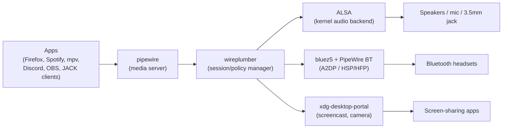

[Home](../README.md) · [↑ 04 Daily Driver](README.md) · [← Previous: 4.1 Browsers](01-browsers.md) · **4.2 Video + audio + PipeWire** · [Next: 4.3 Bluetooth headset →](03-bluetooth-headset-hifi.md)

---

# 4.2 Video, Audio, and the PipeWire Architecture

Kubuntu 26.04 ships **PipeWire** as the sole audio server (replacing PulseAudio entirely) and as the canonical video/screencast broker (replacing the separate JACK and PulseAudio stacks). Understanding the architecture makes every audio/video tweak below make sense.

## The PipeWire architecture at a glance



Short version:

- **PipeWire** is the data-plane server — it routes media streams between sources and sinks with sample-accurate timing.
- **WirePlumber** is the control-plane policy manager — it decides "this app wants audio output → route to the default sink," "this Bluetooth headset just connected → set its profile to A2DP high-quality," etc.
- **ALSA** is the kernel's audio driver — PipeWire speaks ALSA to the kernel.
- **BlueZ 5** + PipeWire's BT plugin handle the Bluetooth codec negotiation and audio routing.
- **xdg-desktop-portal** handles screen-sharing permission dialogs and PipeWire screencast streams.

## 4.2.1 Verify PipeWire is the default

```bash
# The sound server running:
systemctl --user status pipewire.service pipewire-pulse.service wireplumber.service
# All three: active (running).

# What the audio stack identifies itself as:
pactl info | head -3
# Expect: Server Name: PulseAudio (on PipeWire 1.x)

# All sinks (outputs):
pactl list short sinks

# All sources (inputs):
pactl list short sources
```

If `pipewire-pulse` is not active, reinstall:

```bash
sudo apt install -y pipewire pipewire-pulse pipewire-alsa pipewire-jack wireplumber libspa-0.2-bluetooth
systemctl --user enable --now pipewire.service pipewire-pulse.service wireplumber.service
```

## 4.2.2 GUI mixer tools

Two installable frontends; pick one (or install both):

- **`pavucontrol`** — the classic PulseAudio Volume Control. Works perfectly on PipeWire; shows per-app streams, move streams between sinks, set per-app volume.
- **`easyeffects`** — graphical DSP: per-app equalizer, compressor, limiter, reverb. Essential if you want per-app EQ on the headset.
- **`qpwgraph`** — node graph editor, shows the full PipeWire routing visually. Pro-audio tool; useful for debugging.

Install all three:

```bash
sudo apt install -y pavucontrol qpwgraph
flatpak install -y flathub com.github.wwmm.easyeffects
```

KDE also ships its own mixer (`plasma-pa` is the tray icon + widget); that's enough for daily volume changes.

## 4.2.3 Video players

### mpv (primary — scriptable, fast, hardware decode by default)

```bash
sudo apt install -y mpv mpv-mpris
```

Configure `~/.config/mpv/mpv.conf`:

```ini
# ------------------------------------------------------------------------
# mpv.conf — a sane default for Kubuntu 26.04 + AMD iGPU + Wayland
# ------------------------------------------------------------------------

# Use hardware decoding via VA-API on the AMD iGPU (Renoir).
hwdec=vaapi
vo=gpu-next
gpu-api=vulkan

# Match OS audio output format (PipeWire handles bit-depth/sample-rate conversion).
ao=pipewire

# UI:
osc=yes
osd-bar=yes
osd-font='JetBrains Mono NF'
osd-font-size=24

# Screenshots saved to ~/Pictures:
screenshot-directory=~/Pictures/mpv
screenshot-template='mpv-%F-%p'

# Subtitles:
sub-auto=fuzzy
sub-file-paths=subs;sub
slang=en,eng

# Playback:
save-position-on-quit=yes
keep-open=yes
watch-later-directory=~/.cache/mpv/watch_later
```

Verify hardware decode:

```bash
mpv --hwdec=vaapi some-video.mp4 2>&1 | grep -i "hw-decoder"
# Expect: "Using hardware decoder 'vaapi'"
```

### VLC (for everything mpv doesn't open)

```bash
flatpak install -y flathub org.videolan.VLC
```

VLC handles some proprietary DRM-ed streams and malformed files that mpv refuses. Keep it as a backup; don't make it default.

### Jellyfin Desktop (for self-hosted media libraries)

If you have a Jellyfin server on your LAN:

```bash
flatpak install -y flathub com.github.iwalton3.jellyfin-media-player
```

Uses mpv as its backend under the hood; native hardware decode.

## 4.2.4 VA-API verification

VA-API (Video Acceleration API) is the AMD/Intel answer to NVIDIA's NVENC/NVDEC. On the TUF A17 it's the iGPU (Renoir) that handles VA-API — the NVIDIA dGPU could also decode but it's overkill and wakes the dGPU needlessly for video playback.

```bash
# Install the VA-API driver for AMD Renoir and diagnostic tools:
sudo apt install -y mesa-va-drivers libva-utils libvdpau-va-gl

# Check what the iGPU supports:
vainfo
# Expect: output listing VAProfile entries. For Renoir/VCN 2.1:
#   - H.264 (decode + encode)
#   - HEVC (decode + encode)
#   - VP9 (decode)
#   - AV1 (decode only)
# No AV1 encode on this generation.

# Confirm which driver libva is using:
vainfo 2>&1 | grep "Driver"
# Expect: radeonsi_drv_video.so (Mesa's radeonsi)
```

### If VA-API is broken

Symptom: `vainfo` errors out with "iHD_drv_video.so: not found" or "No usable VA driver".

Fix:

```bash
# Explicitly tell libva to use Mesa's radeonsi driver:
echo 'LIBVA_DRIVER_NAME=radeonsi' | sudo tee -a /etc/environment
# Log out, log back in (or reboot).

vainfo
# Should now work.
```

## 4.2.5 VDPAU (the older NVIDIA API, worth mentioning)

VDPAU is the NVIDIA-native counterpart to VA-API. The `vdpauinfo` tool shows dGPU decode capabilities. Useful only if you explicitly want video decode on the dGPU (rare — wakes the dGPU, burns battery). For most workflows, leave video on the iGPU.

```bash
sudo apt install -y vdpauinfo mesa-vdpau-drivers
vdpauinfo 2>/dev/null | head -40
# Shows iGPU VDPAU profiles by default. For dGPU: prime-run vdpauinfo
```

## 4.2.6 Screen brightness and colour

On a Wayland session, screen brightness is controlled via `brightnessctl`:

```bash
sudo apt install -y brightnessctl

# Read:
brightnessctl g

# Max:
brightnessctl m

# Set to 50 %:
brightnessctl s 50%
```

The `Fn+F7/F8` hotkeys should work after [2.3 asusctl](../02-post-install-foundations/03-asus-tuf-hybrid-gpu.md).

### Night Color / f.lux equivalent

Plasma 6.6 has native "Night Light" (System Settings → **Display and Monitor** → Night Light). Schedule, custom times, or always-on. No third-party tool needed.

## 4.2.7 Audio defaults — sample rate, buffer size

PipeWire's defaults are good. One thing worth knowing: PipeWire resamples all streams to a single rate before mixing. Default is usually 48000 Hz. If you have a 96 kHz / 192 kHz audio interface you care about, you can raise the rate:

```bash
mkdir -p ~/.config/pipewire
cp /usr/share/pipewire/pipewire.conf ~/.config/pipewire/
```

Edit `~/.config/pipewire/pipewire.conf`:

```ini
context.properties = {
    default.clock.rate          = 48000
    default.clock.allowed-rates = [ 44100 48000 88200 96000 ]
    default.clock.quantum       = 1024
    default.clock.min-quantum   = 32
    default.clock.max-quantum   = 8192
}
```

Restart:

```bash
systemctl --user restart pipewire.service pipewire-pulse.service wireplumber.service
```

`allowed-rates` makes PipeWire switch sample rate to match the loudest active stream, reducing resampling overhead. Useful for audio purists; noise otherwise.

## 4.2.8 OBS Studio (screencast + recording)

```bash
flatpak install -y flathub com.obsproject.Studio

# Optional: Flathub extension for browser source (used in many stream overlays):
flatpak install -y flathub com.obsproject.Studio.Plugin.OBSVkCapture
```

Launch OBS. Add a source: **Screen Capture (PipeWire)**. A KDE permission dialog should appear asking "Allow OBS to capture the screen?" — approve. From then on, OBS uses PipeWire's screencast stream directly (zero-copy, hardware-path).

Covered in more depth in [2.4.4 Screen sharing](../02-post-install-foundations/04-wayland-plasma-66-nvidia.md#244-screen-sharing-via-pipewire-portal).

## 4.2.9 Microphone noise suppression

Two options:

1. **NVIDIA RTX Voice** equivalent: NVIDIA's Broadcast runs on Windows only; on Linux the closest is `noise-suppression-for-voice` (RNNoise, LADSPA).
2. **EasyEffects presets** — the Flatpak EasyEffects has a preset library.

RNNoise install:

```bash
sudo apt install -y rnnoise libladspa-rnnoise
```

Then in EasyEffects, add a plugin chain to your microphone source:

- **Noise Suppression (RNNoise)**
- **Gate** (-45 dB threshold, 100 ms release)
- **Compressor** (4:1 ratio, -18 dB threshold, 5 ms attack, 50 ms release)
- **Limiter** (-1 dB ceiling)

Save as preset "meeting-mic". Apply whenever you're on a call. Dramatic improvement vs raw TUF A17 mic.

## 4.2.10 Snapshot

```bash
sudo timeshift --create --comments "post-video-audio $(date -I)" --tags D
```

Proceed to [4.3 Bluetooth headset + high-fidelity codecs](03-bluetooth-headset-hifi.md).

---

[Home](../README.md) · [↑ 04 Daily Driver](README.md) · [← Previous: 4.1 Browsers](01-browsers.md) · **4.2 Video + audio + PipeWire** · [Next: 4.3 Bluetooth headset →](03-bluetooth-headset-hifi.md)
