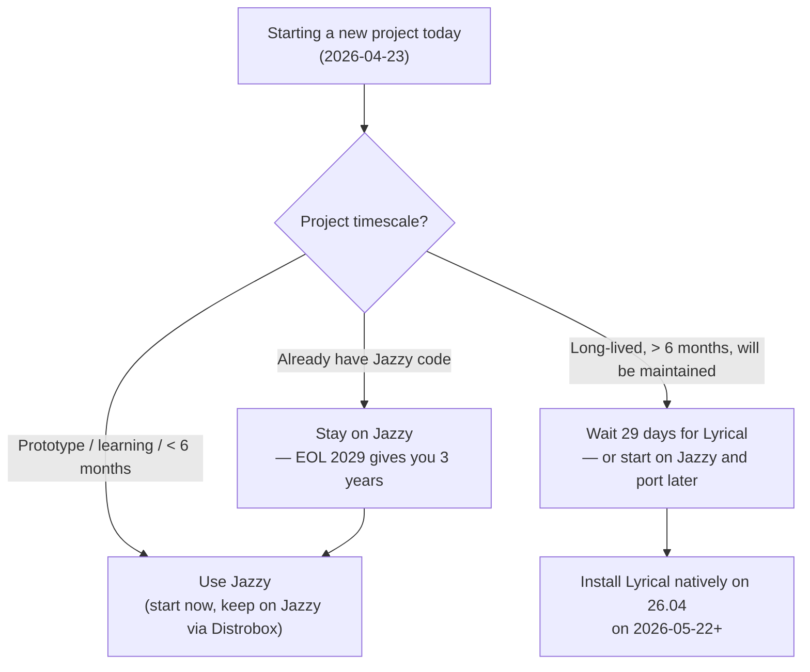

[Home](../README.md) · [↑ 06 ROS 2](README.md) · [← Previous: 06 ROS 2 (section)](README.md) · **6.1 ROS 2 landscape 2026** · [Next: 6.2 Approaches →](02-install-approaches-compared.md)

---

# 6.1 The ROS 2 Landscape in 2026

An overview of the ROS 2 distribution tree as of today (2026-04-23), the Ubuntu-version alignment, support-end dates, and what it means for your Kubuntu 26.04 install.

## The 2026 ROS 2 release tree

| Distribution     | Release date   | EOL            | LTS?      | Ubuntu base      | Python     | Status today                                       |
| ---------------- | -------------- | -------------- | --------- | ---------------- | ---------- | -------------------------------------------------- |
| **Humble Hawksbill** | 2022-05-23 | 2027-05        | Yes (5yr) | 22.04            | 3.10       | Still supported, 1 year left                       |
| **Iron Irwini**  | 2023-05-23     | 2024-11-23     | No (1.5yr)| 22.04            | 3.10       | EOL — do not start new projects                    |
| **Jazzy Jalisco**| 2024-05-23     | 2029-05        | Yes (5yr) | 24.04            | 3.12       | **Current LTS — recommended for bridge phase**    |
| **Kilted Kaiju** | 2025-05-23     | 2026-12-23     | No (1.5yr)| 24.04            | 3.12       | Supported but 1.5 yr window narrowing              |
| **Lyrical Luth** | **2026-05-22** | 2031-05        | **Yes (5yr)** | **26.04**    | 3.14       | **Ships in 29 days — will become recommended**    |
| M Turtle (codename TBD) | 2027-05 | 2028-12     | No (1.5yr)| likely 26.04     | TBD        | Future                                             |

Source: [ROS 2 Release Schedule](https://docs.ros.org/en/jazzy/The-ROS2-Project/Release-Schedule.html), [Lyrical Luth release notes](https://docs.ros.org/en/kilted/Releases/Release-Lyrical-Luth.html).

## Why Lyrical Luth is the right long-term target

You installed **Kubuntu 26.04 LTS** (April 2031 EOL). The ROS 2 release aligned with Ubuntu 26.04 as Tier 1 platform is **Lyrical Luth** (May 2026 release, May 2031 EOL).

This is **perfect LTS alignment**:

- Kubuntu 26.04 LTS: April 2026 → April 2031 (standard support).
- ROS 2 Lyrical Luth: May 2026 → May 2031.

Both EOL dates within 30 days of each other — you can run this laptop on exactly this pair for 5 years without either component being out-of-date or requiring a distro upgrade.

## Why you are in a bridge phase right now

As of 2026-04-23, **Lyrical Luth does not exist yet** — it's still in feature freeze. The earliest you can install it natively on Kubuntu 26.04 is **2026-05-22**.

Meanwhile, ROS 2 Jazzy Jalisco:

- Ships for Ubuntu 24.04 natively. Ubuntu 26.04 does not have `ros-jazzy-*` packages in the ROS build farm (and won't — Jazzy targets 24.04 end-of-life 2029).
- Runs **perfectly** inside a Distrobox container with an Ubuntu 24.04 userland on top of your 26.04 host kernel. The ROS code is mostly userspace; the kernel 7.0 you're running works fine.

**This is the bridge.** For 29 days, you use Jazzy-in-Distrobox. Then you install Lyrical natively when it ships.

## ROS 2 LTS alignment with Ubuntu LTS — the rule

ROS 2's release policy matches Ubuntu's:

- **Every 2 years in May** = an ROS 2 LTS (5-year support), targeting the Ubuntu LTS that shipped the previous month.
- **Every 2 years in May (odd years)** = a non-LTS ROS 2 (1.5-year support), targeting the same Ubuntu LTS as the previous LTS ROS.

| ROS 2 LTS          | Ubuntu LTS base        | Both EOL             |
| ------------------ | ---------------------- | -------------------- |
| Humble (2022)      | 22.04                  | 2027                 |
| Jazzy (2024)       | 24.04                  | 2029                 |
| **Lyrical (2026)** | **26.04**              | **2031**             |
| (2028)             | 28.04 (future)         | 2033                 |

Non-LTS ROS (Iron, Kilted, M Turtle) fills the odd-year gap and always targets the most recent Ubuntu LTS at its release time.

## Which ROS to pick for a NEW project today

Decision tree:

For this guide's setup, **both are installable, both are useful:**

- **Jazzy in Distrobox** — today, for immediate projects and learning.
- **Lyrical natively** — starting May 22, as the primary long-term ROS environment.

Set both up. The Distrobox container for Jazzy costs ~2 GB of disk, doesn't run services when you're not using it, and stays in rotation for legacy Jazzy code. Native Lyrical becomes your "new projects" default.

## What you get in Lyrical vs Jazzy

Per the [Lyrical Luth release notes](https://docs.ros.org/en/kilted/Releases/Release-Lyrical-Luth.html), highlights (plus what I know from the alpha/beta cycles):

- **Python 3.14** — matches Ubuntu 26.04's default. Pattern-matching, better typing, faster.
- **rclcpp with C++23** — structured bindings, std::expected, improvements across nodes.
- **DDS v1.5 vendors** — RMW implementations ported to the new DDS security features.
- **Gazebo Ionic or later** — the newer Gazebo (was Harmonic, now Ionic) with improved physics and sensor simulation.
- **Nav2 on Lyrical** — navigation stack compiled against the new stack; improvements over Jazzy.
- **MoveIt 2 on Lyrical** — manipulator motion planning.

None of these are *revolutionary* vs Jazzy, but you do get 2 years of incremental improvements without the 2028 upgrade deadline Jazzy has.

## Kilted Kaiju — why you're probably not using it

Kilted Kaiju is the non-LTS May 2025 release. It runs on Ubuntu 24.04 like Jazzy. Its EOL is December 2026 — just 8 months from today.

**Do not start new work on Kilted.** There is no scenario where Kilted is the right choice over Jazzy or Lyrical:

- If you want the absolute newest features before Lyrical — wait 29 days for Lyrical.
- If you want a stable base — pick Jazzy (4 more years of support) or Lyrical (5 years).
- If you pulled a Kilted-pinned open-source project — port it to Jazzy (same 24.04 base, most packages source-compatible) instead of committing to 8 months of support.

## Humble Hawksbill — legacy compatibility

You might encounter Humble because:

- Older marine-robotics codebases (2022-2023 era) pin Humble.
- Some vendor ROS SDKs (BlueRobotics, NVIDIA Isaac ROS Nano) supported Humble first, Jazzy months later.

If you need Humble: a second Distrobox container with Ubuntu 22.04 base and `ros-humble-*` installed. Exactly the [`docs/03-dev-environment/01-containers.md`](../../docs/03-dev-environment/01-containers.md) recipe, still valid on your 26.04 host.

## Tier 1 vs Tier 2 platform support

ROS 2 classifies platform support:

- **Tier 1**: fully-tested by OSRF (Open Source Robotics Foundation), binary packages published, regressions block releases. Currently: Ubuntu 24.04 (Jazzy) + Ubuntu 24.04 (Kilted) + Windows 10 + RHEL 9.
- **Tier 2**: best-effort support; some packages may be missing, no regression blocking.
- **Tier 3**: user-maintained; source builds work but no binaries.

For Lyrical when it ships:

- **Tier 1**: Ubuntu 26.04 (amd64, arm64), Windows 11, RHEL 10.
- **Tier 2**: macOS Sonoma+.
- **Tier 3**: older distros via source build.

You're on Tier 1 amd64. The happiest possible path.

## Summary

| Today (2026-04-23 to 2026-05-21)                               | May 22 onwards                                                 |
| -------------------------------------------------------------- | -------------------------------------------------------------- |
| **Bridge phase** with Distrobox + Jazzy                        | **Native phase** with Lyrical installed via apt                |
| Use [6.3](03-distrobox-bridge-jazzy-now.md) to set up now       | Use [6.4](04-native-lyrical-after-may-22.md) when Lyrical ships |
| Keep Jazzy around for legacy work (EOL 2029)                   | Keep Jazzy container for cross-version tests                   |

Proceed to [6.2 Install approaches compared](02-install-approaches-compared.md) for the scoring of **why** Distrobox is the right tool for the bridge (and why Podman Compose, rocker, VM are not).

---

[Home](../README.md) · [↑ 06 ROS 2](README.md) · [← Previous: 06 ROS 2 (section)](README.md) · **6.1 ROS 2 landscape 2026** · [Next: 6.2 Approaches →](02-install-approaches-compared.md)
