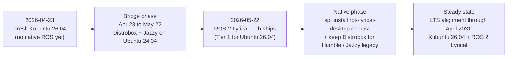

[Home](../README.md) · [← Previous: 5.5 Frameworks & databases](../05-web-development/05-frameworks-and-databases.md) · **06 — ROS 2 for Robotics** · [Next: 6.1 ROS 2 landscape →](01-ros2-landscape-2026.md)

---

# 06 — ROS 2 for Robotics

Research-backed recommendation and step-by-step instructions for installing ROS 2 on Kubuntu 26.04 LTS, as of **2026-04-23**.

## The researched verdict in one sentence

**Use Distrobox with an Ubuntu-24.04-based ROS 2 Jazzy container today; switch to a native `apt install ros-lyrical-desktop` on the 26.04 host on or after 2026-05-22.**

## Why — the short version

1. **Kubuntu 26.04 shipped today.** ROS 2 has never offered `apt` packages for a just-released Ubuntu LTS on day zero — the ROS build farm always lags the Ubuntu release by some weeks.
2. **ROS 2 Lyrical Luth ships 2026-05-22** (29 days from today), and it provides **Tier 1 native support for Ubuntu 26.04 "Resolute"** on amd64 and arm64 as a 5-year LTS aligned with Kubuntu 26.04's own LTS window (both end April 2031). This is the correct long-term target.
3. **In the 29-day gap**, Distrobox with an Ubuntu 24.04 userland gives you ROS 2 Jazzy (current LTS, EOL May 2029) with near-native GUI and hardware-passthrough. It is identical to how you've been running ROS in the `docs/` setup.
4. **Podman Compose, `rocker`, and full VMs are worse on 3 of 5 axes** (integration, GUI performance, isolation overhead, reproducibility, isolation strength) for day-to-day robotics development. They are covered in [6.2](02-install-approaches-compared.md) for completeness.

Read [6.1](01-ros2-landscape-2026.md) for the full landscape and the decision matrix, then [6.3](03-distrobox-bridge-jazzy-now.md) for the day-0 recipe and [6.4](04-native-lyrical-after-may-22.md) for the day-30 switchover.

## Steps (phased)

### Bridge phase — 2026-04-23 through 2026-05-21

| #   | Step                                                                           | Time   |
| ---:| ------------------------------------------------------------------------------ | ------ |
| 6.1 | [Read the 2026 ROS 2 landscape](01-ros2-landscape-2026.md)                     | 10 min |
| 6.2 | [Understand why Distrobox wins the comparison](02-install-approaches-compared.md) | 10 min |
| 6.3 | [Install Distrobox + `ros2-jazzy` on Ubuntu 24.04 base](03-distrobox-bridge-jazzy-now.md) | 30 min |

### Native phase — 2026-05-22 onwards

| #   | Step                                                                           | Time   |
| ---:| ------------------------------------------------------------------------------ | ------ |
| 6.4 | [Native `apt install ros-lyrical-desktop` on the 26.04 host + retain Distrobox for Jazzy/Humble legacy](04-native-lyrical-after-may-22.md) | 45 min |

## Phased verdict visualised

## What carries over unchanged from `docs/03-dev-environment/01-containers.md`

The rootless-Podman-plus-Distrobox design pattern is correct on 26.04 exactly as it was on 24.04. Specifically:

- `podman` + `distrobox` + `uidmap` + `slirp4netns` + `fuse-overlayfs` from the Ubuntu archive.
- `systemctl --user enable --now podman.socket` to let rootless containers use the socket.
- `~/.config/containers/containers.conf` with `events_logger = "file"` to avoid journald spam.
- `--network=host` flag on ROS containers for DDS multicast discovery.
- `distrobox-export` for exposing `rviz2`, `gz` etc. as host-menu apps.

Changes vs the `docs/` recipe:

- Base image for the Jazzy container stays `ubuntu:24.04` (because Jazzy targets 24.04). On 26.04 host this still works via the slirp4netns userns mapping.
- Once Lyrical is installed natively, you drop the `ros2-jazzy` container from daily rotation but keep it for a 6-month overlap (per the [v2 verdict's "retain prior version for 6 months" discipline](../../docs/01-verdict_v2.md#revised-non-negotiable-technical-positions)).

---

[Home](../README.md) · [← Previous: 5.5 Frameworks & databases](../05-web-development/05-frameworks-and-databases.md) · **06 — ROS 2 for Robotics** · [Next: 6.1 ROS 2 landscape →](01-ros2-landscape-2026.md)
